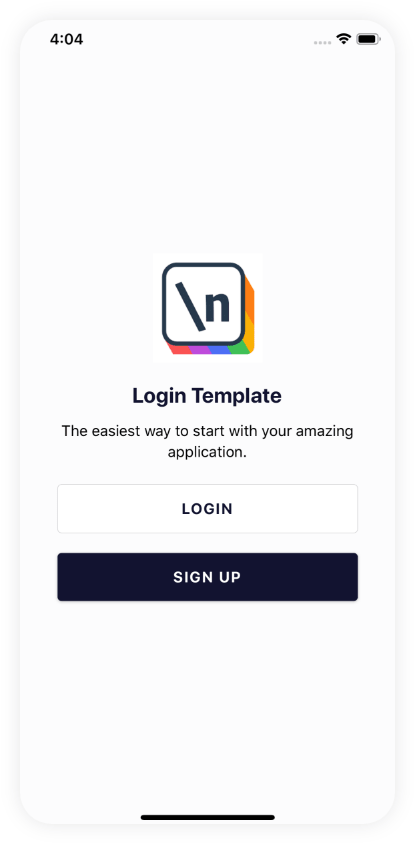
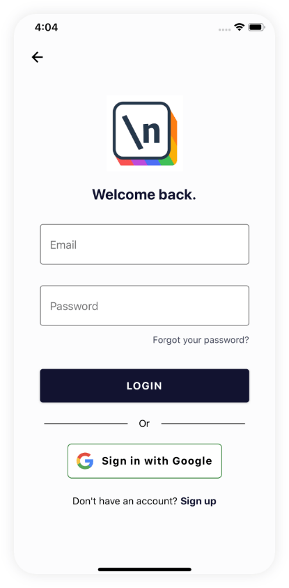
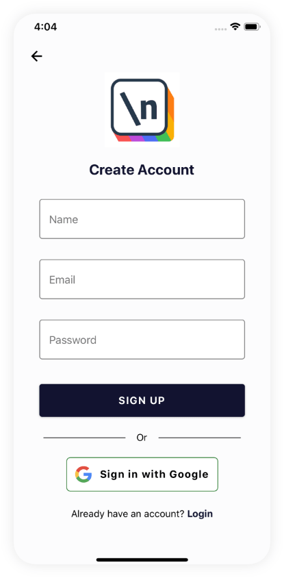
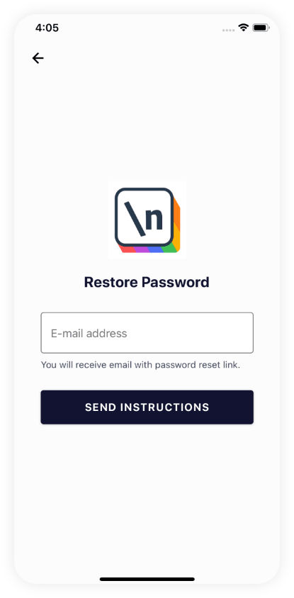
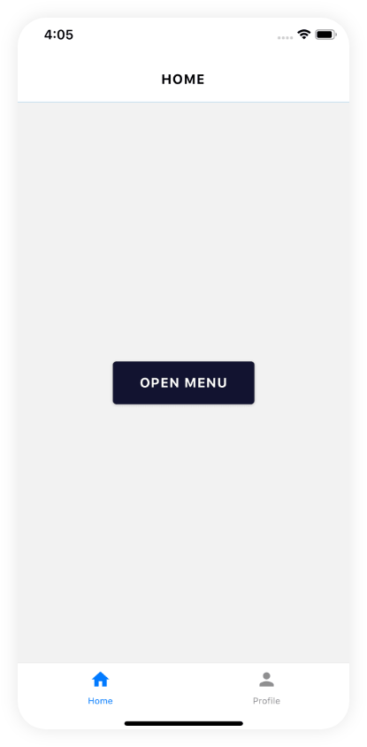
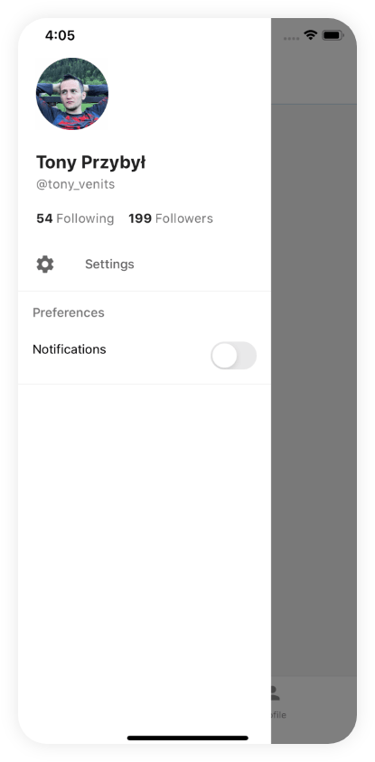
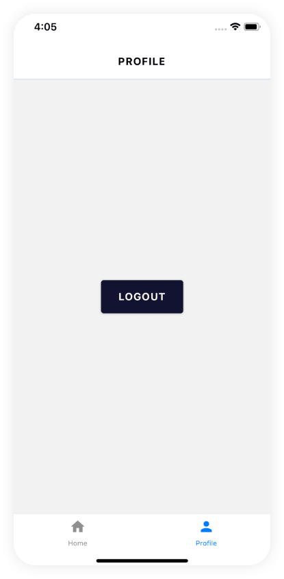

# NodeJS Game Telegram Bot

Solutions to Fullstack.io's "Creating a React Native Login" projects.

## ✨ Screenshots

## 🚀 Usage

`npm install` - installing dependencies.

`npm run start` - run production server.

## Contributing
Pull requests are welcome. For major changes, please open an issue first to discuss what you would like to change.

Please make sure to update tests as appropriate.

## License
[MIT](https://choosealicense.com/licenses/mit/)
